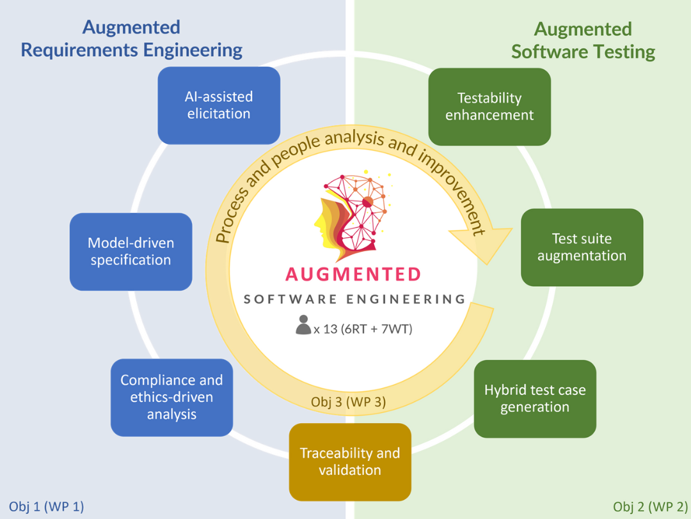

---
# Display name
#title: #NAME OF PROYECT

# Name pronunciation (optional)
name_pronunciation: ''

# Full name (for SEO)
first_name: ''
last_name: ''

# Status emoji
status:
  icon: ☕️

# Is this the primary user of the site?
superuser: true

# Role/position/tagline
role: ''

# Organizations/Affiliations to show in About widget
organizations:
#  - name: ORGANIZATION
#    url: https://github.com/Trust4AI

# Short bio (displayed in user profile at end of posts)
bio: ''

# Interests to show in About widget
# interests:
    # - Artificial Intelligence
    # - Computational Linguistics
    # - Information Retrieval

# Education to show in About widget
education:
  # courses:
  #   - course: PhD in Artificial Intelligence
  #     institution: Stanford University
  #     year: 2012
  #   - course: MEng in Artificial Intelligence
  #     institution: Massachusetts Institute of Technology
  #     year: 2009
  #   - course: BSc in Artificial Intelligence
  #     institution: Massachusetts Institute of Technology
  #     year: 2008

Skills:
# For available icons, see: https://docs.hugoblox.com/getting-started/page-builder/#icons
skills:
  # - name: Technical
  #   items:
  #     - name: Python
  #       description: ''
  #       percent: 80
  #       icon: python
  #       icon_pack: fab
  #     - name: Data Science
  #       description: ''
  #       percent: 100
  #       icon: chart-line
  #       icon_pack: fas
  #     - name: SQL
  #       description: ''
  #       percent: 40
  #       icon: database
  #       icon_pack: fas
  # - name: Hobbies
  #   color: '#eeac02'
  #   color_border: '#f0bf23'
  #   items:
  #     - name: Hiking
  #       description: ''
  #       percent: 60
  #       icon: person-hiking
  #       icon_pack: fas
  #     - name: Cats
  #       description: ''
  #       percent: 100
  #       icon: cat
  #       icon_pack: fas
  #     - name: Mendeley
  #       description: ''
  #       percent: 100
  #       icon: academicons/mendeley
          
  #     - name: Photography
  #       description: ''
  #       percent: 80
  #       icon: camera-retro
  #       icon_pack: fas

# Social/Academic Networking
# For available icons, see: https://docs.hugoblox.com/getting-started/page-builder/#icons
#   For an email link, use "fas" icon pack, "envelope" icon, and a link in the
#   form "mailto:your-email@example.com" or "/#contact" for contact widget.

social:
 # - icon: envelope
 #   icon_pack: fas
 #   link: '/#contact'
 # - icon: twitter
 #   icon_pack: fab
 #   link: https://twitter.com/GeorgeCushen
 #   label: Follow me on Twitter
 #   display:
 #     header: true
 # - icon: graduation-cap # Alternatively, use `google-scholar` icon from `ai` icon pack
 #   icon_pack: fas
 #   link: https://www.mendeley.com/reference-manager/library/groups/private/a14b6eab-d143-392e-a380-2ffb0ea8b3c2/all-references/
  - icon: github
    icon_pack: fab
    link: https://github.com/isa-group/aseproject
#  - icon: linkedin
#    icon_pack: fab
#    link: https://www.linkedin.com/
   # Link to a PDF of your resume/CV.
  # To use: copy your resume to `static/uploads/resume.pdf`, enable `ai` icons in `params.yaml`,
  # and uncomment the lines below.
#  - icon: cv
#    icon_pack: ai
#    link: uploads/resume.pdf

# Highlight the author in author lists? (true/false)
highlight_name: true
---

Recent advances in machine learning and generative artificial intelligence (GenAI) are driving a major transformation in software development. Tools such as coding assistants, test generators, and chatbots, fuelled by advances in large language models (LLMs) and massive amounts of data, are delivering an unparalleled level of automation while raising concerns related to trust, privacy, and sustainability. Analogously, AI is rapidly becoming a fundamental component of most software systems, often critical, as seen in the growing prevalence of autonomous systems. These emerging systems bring great promises in terms of productivity and innovation but also highlight the limitations of traditional SE, particularly in addressing issues such as non-determinism and the evolving nature of data.

Aligned with current initiatives shaping the roadmap of SE over the next decade, the ISA project presents the notion of Augmented Software Engineering (ASE), emphasising how technologies will progressively enhance the capabilities of software engineers, while keeping them in control, enabling the development of more sophisticated and reliable software solutions. Accordingly, the goal of ISA is to augment the capabilities of software engineers in requirements, testing, and their intersection by designing human-centred tools, techniques, and processes. To achieve this objective, we will focus on three key differentiating points: 1) the interconnection between requirements and software testing as a fundamental enabler for validating AI-generated software applications, 2) a holistic approach that integrates tools, processes, and people, with the needs of engineers serving as the cornerstone for all decision-making, and 3) the adoption of disruptive technologies, including but not limited to GenAI, to support engineers throughout the software development lifecycle. 

